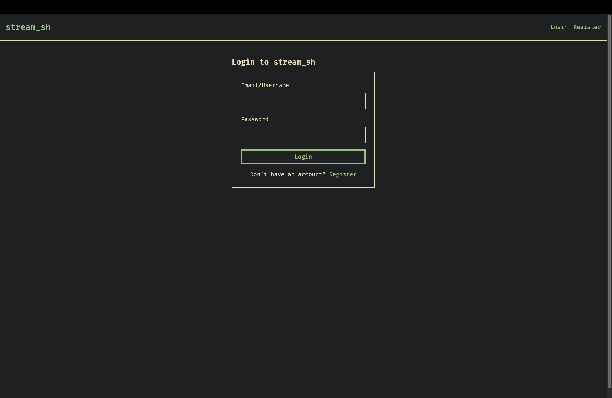
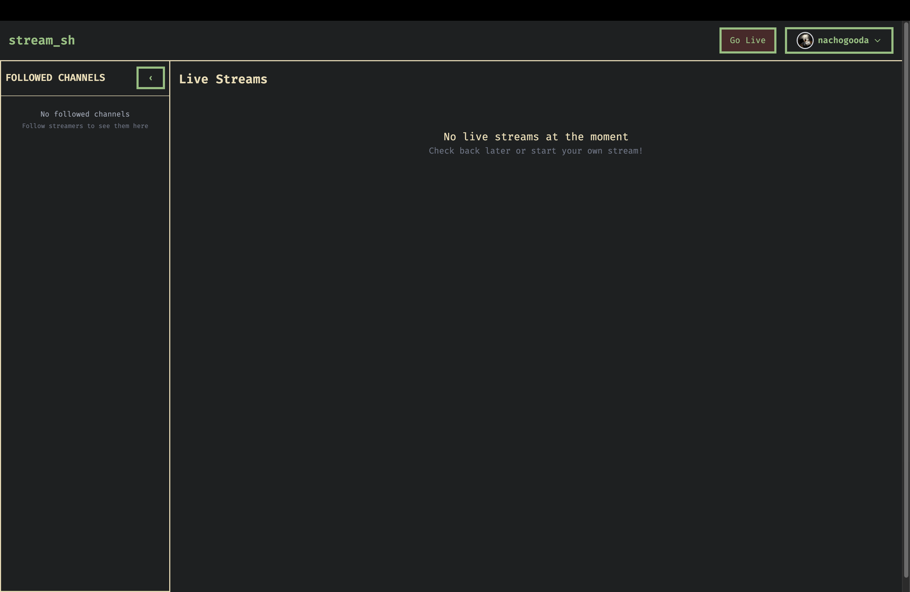
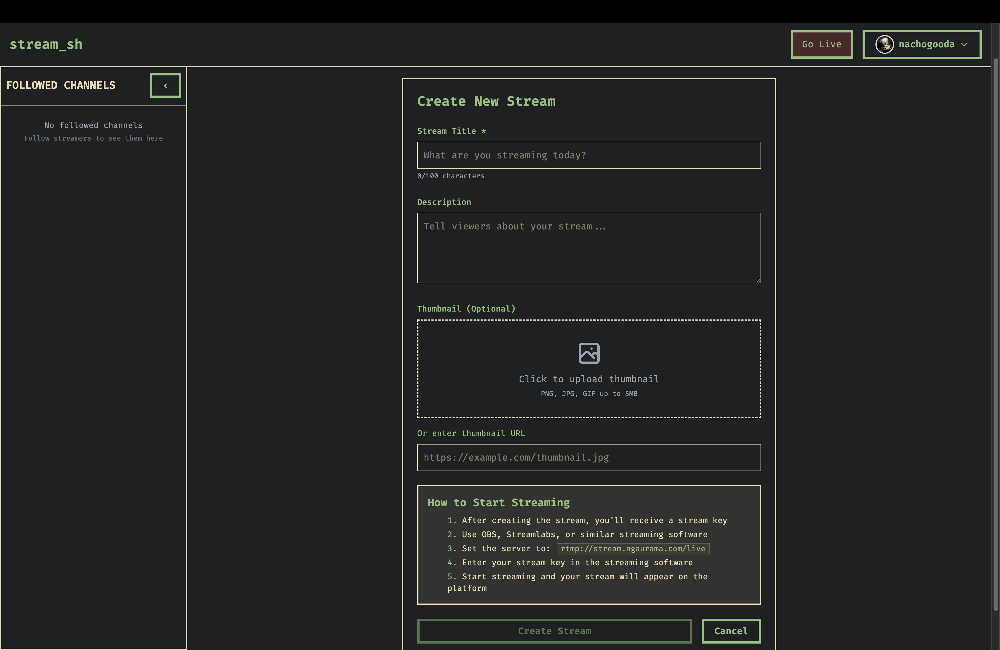
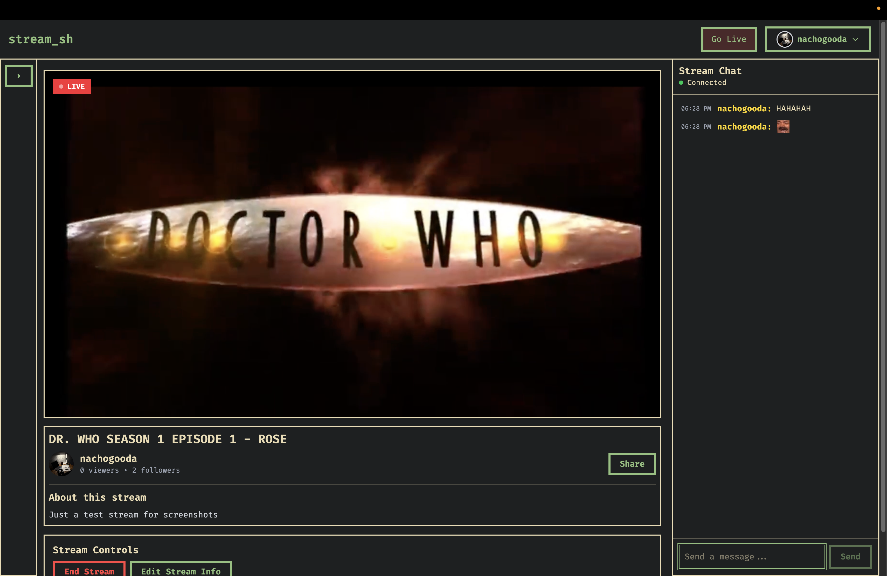
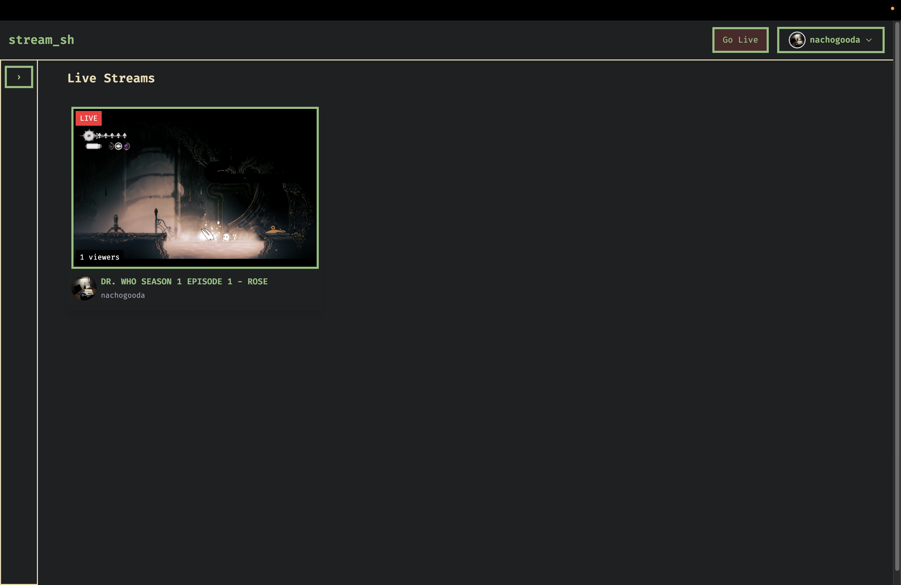

# stream_sh

A full-stack live streaming platform built independently from scratch.
It features low-latency livestreaming, real-time chat, channel pages, and a clean, minimal React UI.
The backend is powered by FastAPI with an RTMP -> HLS (M3U8) processing pipeline through nginx.

Live at: https://stream.ngaurama.com
---

## Features
### Core Streaming
+ RTMP ingest (OBS, Streamlabs, etc. can stream directly)
+ Automatic HLS transcoding (Segmented .ts + .m3u8 playlist generation with 60s playback)
+ Adaptive & low-latency playback using raw <video> HLS clients
+ Live channel pages with auto-refreshing video sources

### User and Channel features
+ Channel creation and live/offline status
+ Custom thumbnails & stream titles
+ Real-time chat system (WebSocket)
+ Viewer count tracking (WebSocket)

### Other Features
+ Twitch emotes support in chat
+ 16+ themes available
+ Chat and user moderation (coming soon... one day)

### Tech Stack
+ FastAPI backend (REST API + WebSockets)
+ SQLAlchemy
+ Postgres Database
+ React + Tailwind frontend
+ NGINX reverse proxy
+ RTMP -> HLS streaming server
+ Docker-based deployment
+ Auto-reload for HLS playlists

---

## Project Structure

```
stream_sh/
├── backend/
│   ├── app
│   │   ├── __init__.py
│   │   ├── config.py 
│   │   ├── database.py        # Postgres DB setup
│   │   ├── faker_api.py       # Testing service
│   │   ├── main.py
│   │   ├── models.py          # ORM models
│   │   ├── routes/            # auth, oauth2, follows, rtmp, stream, chat, upload
│   │   └── schemas.py         # ORM response schemas
│   ├── Dockerfile
│   └── requirements.txt     
│
├── frontend/
│   ├── src/
│   │   ├── pages/             # Channel pages, home, login, dashboard
│   │   ├── components/        # Video player, chat UI, layout
│   │   ├── hooks/             # API hooks
│   │   ├── contexts/  
│   │   ├── types/
│   │   ├── themes/
│   │   ├── api.ts
│   │   ├── App.css
│   │   ├── App.tsx
│   │   ├── index.css
│   │   └── main.tsx
│   └── public/
│
├── nginx/
│   ├── nginx.conf             # Reverse proxy + HLS config
│   └── dockerfile
│
└── docker-compose.yml
```
---
## Screenshots
### Login Page
  
### Homepage
  
### Stream Creation
  
### Livestream
  
### Homepage showing active streams
  

--- 

## Author
+ Nitai Gauramani


